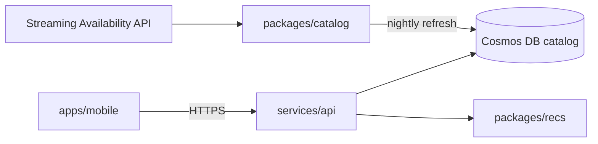
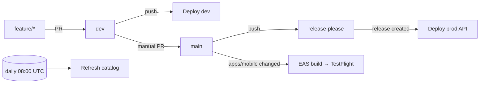

<p align="center">
  <picture>
    <source media="(prefers-color-scheme: dark)" srcset="brand/svg/banner-dark.svg">
    
  </picture>
</p>

<p align="center">
  <a href="https://github.com/manali-co/what-should-we-watch/actions/workflows/ci.yml"></a>
  <a href="https://github.com/manali-co/what-should-we-watch/actions/workflows/deploy-dev.yml"></a>
  <a href="https://github.com/manali-co/what-should-we-watch/actions/workflows/release.yml"></a>
  <a href="https://github.com/manali-co/what-should-we-watch/actions/workflows/deploy-ios.yml"></a>
  <a href="https://github.com/manali-co/what-should-we-watch/actions/workflows/refresh-catalog.yml"></a>
</p>
<p align="center">
  
  
  
  <a href="LICENSE"></a>
</p>

You're on the couch. Someone asks the question in the name. Twenty minutes later you're still scrolling.

**What Should We Watch** fixes that evening. Tap a mood or two, and it deals you a deck of ten films that are *actually* on the streaming services you already pay for, in your country, tonight. Swipe to decide. Every swipe teaches it a little more about your taste.

<p align="center">
  <picture>
    <source media="(prefers-color-scheme: dark)" srcset="brand/svg/mark-animated-dark.svg">
    
  </picture>
</p>

## How it feels

- **Moods, not genres.** "Cozy", "mind-bender", "big laughs". Pick one or stack a few.
- **Only what you can play right now.** Availability is checked per service and per country, so nothing in the deck sends you to a rental page.
- **Four swipes.** Left is pass, right is like, up is maybe, down is "seen it". A tap plays the trailer.
- **A shortlist that fills itself.** Likes and maybes land in one place for when the group finally sits down.
- **Sign in once, keep your taste.** Google or an email code today, Apple next. Face ID guards the app on relaunch.

## Get it

The iOS build ships to TestFlight from `main` through the release workflow below. There is no public store listing yet, so there's nothing to link here; this line will change when there is.

## How the repo fits together

This is a monorepo. Python is managed with **uv**, JavaScript with **npm** inside `apps/mobile`.

| Path | What lives there |
|---|---|
| `apps/mobile` | The app. Expo SDK 57 / React Native, Clerk auth, the swipe deck, taste and shortlist screens. |
| `services/api` | FastAPI on Azure Functions (Flex Consumption). Catalog queries, recommendations, auth webhooks. |
| `packages/recs` | The recommendation engine: moods in, ranked films out. |
| `packages/catalog` | Catalog ingest, poster pipeline, and the vibe embeddings the recs lean on. |
| `infra` | Bicep modules and an `azd` project for dev and prod. |
| `docs` | Design specs, ADRs, the UX brief, and the legal pages. |
| `brand` | Logo, icons, wordmark and README art. See [`brand/README.md`](brand/README.md). |



## Run it locally

**API**

```sh
cd services/api
uv sync --extra dev
cp local.settings.json.example local.settings.json   # fill in the endpoints you have
uv run pytest
func start
```

**Mobile**

```sh
cd apps/mobile
npm install --legacy-peer-deps
npx expo start          # then press i for the iOS simulator, a for Android
npx tsc --noEmit && npx jest
```

## How it ships



- **CI** runs on every PR and on pushes to `dev`, `main` and `feature/**`. It only runs the jobs whose paths changed: `api` (ruff, mypy, pytest) and `mobile` (tsc, jest).
- **Deploy (dev)** provisions `rg-wsww-dev` from Bicep and publishes the Functions app on every push to `dev`.
- **Release** uses release-please on `main`. When it cuts an API release, the prod deploy runs.
- **Deploy iOS** builds on EAS and submits to TestFlight whenever `apps/mobile` changes on `main`. Promotion from `dev` to `main` is a deliberate, human PR.
- **Refresh catalog** re-ingests new titles every morning so the deck never draws from a stale snapshot.

## Data and attribution

This app does not use TMDB. Streaming availability comes from the Streaming Availability API (Movie of the Night), and the app shows the required **JustWatch** attribution in Settings › About. Privacy policy and terms live in [`docs/`](docs/).

## Contributing

Branch from `dev`, keep commits in Conventional Commits form (`feat:`, `fix:`, `chore:`), and open a PR back into `dev`. CI has to be green. Visual changes go through the Claude Design project first and get ported; please don't improvise UI in code.

## License and credit

This one is ours. The code, designs and data pipelines are published so you can read them, learn from them and argue with them, but they're proprietary: no copying, shipping, training on, or building products from any of it without written permission. Ask in an issue; we're friendly. Full terms in [LICENSE](LICENSE).

If you reference the project, please credit Manali and cite it ([`CITATION.cff`](CITATION.cff)):

```bibtex
@software{manali_wsww_2026,
  author = {Manali and Agrawal, Ayush},
  title  = {What Should We Watch: a mood-driven film picker},
  year   = {2026},
  url    = {https://github.com/manali-co/what-should-we-watch}
}
```

<p align="center">
  <br>
  <a href="https://github.com/manali-co">
    <picture>
      <source media="(prefers-color-scheme: dark)" srcset="https://raw.githubusercontent.com/manali-co/.github/main/brand/svg/lockup-dark.svg">
      
    </picture>
  </a>
  <br>
  <sub>Made by Manali.</sub>
</p>
